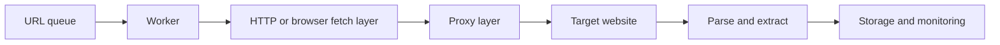

## Scraping Architecture Is Really About Reliability Under Repetition
A scraper that works on ten pages is not necessarily a good scraping system. Architecture becomes important when the work repeats: hundreds of URLs, multiple domains, browser-based tasks, proxy coordination, retries, and data pipelines that need to remain stable over time.
That is what web scraping architecture is really about. It is not just a diagram of components. It is the design of how those components behave together when the workload grows.
This guide explains the core layers of modern scraping architecture, how queues, workers, browsers, proxies, storage, and monitoring fit together, and why scaling the system means more than simply adding more workers. It pairs naturally with [scraping data at scale](https://bytesflows.com/blog/scraping-data-at-scale), [proxy pools for web scraping](https://bytesflows.com/blog/proxy-pools-web-scraping), and [browser automation for web scraping](https://bytesflows.com/blog/browser-automation-web-scraping).
## What Web Scraping Architecture Actually Means
Web scraping architecture is the design of the full collection system, not just the fetch code.
That usually includes:
- how URLs are discovered and queued
- how workers retrieve and process them
- how browser or HTTP layers fetch the content
- how proxy infrastructure routes traffic
- how data is stored and validated
- how retries and monitoring are handled
A useful architecture keeps the workflow stable as request volume, target diversity, and data complexity grow.
## The Core Components
### URL queue
The queue holds pending work and controls what gets processed next.
Typical responsibilities include:
- managing crawl depth or task priority
- preventing duplicate work
- spreading load across workers
- enabling retries without losing state
### Workers
Workers pull tasks from the queue and execute the fetching and extraction logic.
They may use:
- lightweight HTTP clients for simpler pages
- browser automation for JavaScript-heavy or protected targets
- custom parsing or extraction logic per task type
### Proxy layer
The proxy layer handles traffic identity and route quality.
This is where systems use:
- residential proxy gateways
- rotating or sticky sessions
- geo-targeted traffic
- proxy health and capacity logic
### Storage layer
The extracted output must go somewhere usable.
That can mean:
- relational databases
- object storage or data lakes
- APIs
- downstream analytics or RAG pipelines
### Monitoring layer
Monitoring makes the system observable.
Without it, scaling becomes guesswork.
## A Practical High-Level Flow
A useful architecture often looks like this:

This diagram matters because it shows that scraping is not just “request page, parse HTML.” It is a coordinated system where each layer affects the reliability of the next.
## Why the Queue Matters More Than People Expect
A queue is not just a convenience for batching URLs. It is part of how the system controls load and failure.
A good queue design helps with:
- retry scheduling
- deduplication
- distributing work across domains
- delaying tasks after errors
- prioritizing high-value URLs
Without that control, workers tend to create bursts, duplicate effort, or unstable retry loops.
## HTTP Workers vs Browser Workers
Not every target needs the same fetch strategy.
### HTTP workers
Best for:
- static or lightly rendered pages
- cheaper and faster collection
- high-volume simple scraping
### Browser workers
Best for:
- JavaScript-heavy pages
- challenge-heavy targets
- interaction-based workflows
- login or multi-step collection
This is why strong architectures often mix both. HTTP for cheap collection where possible, browser automation where necessary.
## Why the Proxy Layer Is an Architectural Layer, Not a Tool Add-On
It is tempting to think of proxies as something you bolt on when blocks begin. In production systems, that is too late.
The proxy layer affects:
- request identity
- geography
- concurrency safety
- session continuity
- retry outcomes
- overall success rate under load
That is why proxy design belongs in the architecture from the beginning, especially for systems that browse repeatedly or operate on stricter targets.
Related background from [best proxies for web scraping](https://bytesflows.com/blog/best-proxies-for-web-scraping), [residential proxies](https://bytesflows.com/blog/residential-proxies), and [proxy rotation strategies](https://bytesflows.com/blog/proxy-rotation-strategies) fits directly into this layer.
## Storage Is Not the End of the Pipeline
Storage is where the data becomes useful, but it is also where quality problems start to matter more.
A strong architecture thinks about:
- schema consistency
- validation before write
- deduplication
- handling partial or failed extractions
- separating raw and processed outputs when needed
This matters because a scraping system that stores low-quality or inconsistent output may scale technically while failing analytically.
## Monitoring Is What Makes Scale Real
A scraping system cannot be scaled responsibly without visibility.
Important metrics often include:
- success rate
- block or challenge rate
- latency
- queue depth
- retry frequency
- extraction quality
These metrics tell you whether the system is healthy, not just whether it is busy.
## Common Architecture Choices
### Single rotating gateway
Simple to operate and often enough for many systems.
### Proxy list with custom rotation
More control, but more operational complexity.
### Dedicated browser pools
Useful for heavier rendering workloads.
### Hybrid HTTP plus browser workers
Often the most efficient architecture for mixed targets.
The right choice depends on target complexity, scale, and how much control the system needs.
## Common Mistakes
### Scaling workers before validating proxy and target tolerance
This often increases failure faster than throughput.
### Using the same strategy for every domain
Different targets often need different pacing and fetch modes.
### Ignoring the cost of browser workers
Heavy rendering changes the economics of scaling.
### Treating retries as architecture-neutral
Retry behavior is a core architectural concern, not an afterthought.
### Monitoring volume but not quality
A busy system is not automatically a productive system.
## Best Practices for Scraping Architecture
### Start with a clear separation of layers
Queues, workers, proxy routing, extraction, and storage should be understandable on their own.
### Mix HTTP and browser workers intentionally
Do not pay browser cost where HTTP is enough.
### Design the proxy layer early
Reliable scale depends on identity as much as on code.
### Control retries and domain pacing centrally
Architecture should prevent workers from amplifying failure.
### Monitor output quality, not just request count
The goal is usable data, not just more activity.
Helpful supporting tools and related pieces include [proxy checker](https://bytesflows.com/blog/proxy-checker), [scraping test](https://bytesflows.com/blog/scraping-test-tool-detect-blocks), and [scraping data at scale](https://bytesflows.com/blog/scraping-data-at-scale).
## Conclusion
Web scraping architecture is the design of how collection systems stay reliable when the workload becomes large, repeated, and varied. Queues manage work. Workers execute tasks. Browsers or HTTP clients fetch content. Proxy layers protect traffic identity. Storage preserves usable output. Monitoring tells you whether the system is actually healthy.
The strongest architectures do not only move data quickly. They move it predictably, observably, and with enough control to keep scaling without collapsing into blocks, retries, or unusable output. That is what makes architecture the difference between a script and a real scraping system.
If you want the strongest next reading path from here, continue with [scraping data at scale](https://bytesflows.com/blog/scraping-data-at-scale), [proxy pools for web scraping](https://bytesflows.com/blog/proxy-pools-web-scraping), [browser automation for web scraping](https://bytesflows.com/blog/browser-automation-web-scraping), and [best proxies for web scraping](https://bytesflows.com/blog/best-proxies-for-web-scraping).
## Further reading
- [Scraping data at scale](https://bytesflows.com/blog/scraping-data-at-scale)
- [Proxy pools for web scraping](https://bytesflows.com/blog/proxy-pools-web-scraping)
- [Browser automation for web scraping](https://bytesflows.com/blog/browser-automation-web-scraping)
- [Best proxies for web scraping](https://bytesflows.com/blog/best-proxies-for-web-scraping)
- [Residential proxies](https://bytesflows.com/blog/residential-proxies)
- [Proxy rotation strategies](https://bytesflows.com/blog/proxy-rotation-strategies)
- [How many proxies do you need](https://bytesflows.com/blog/how-many-proxies-need-scraping)
