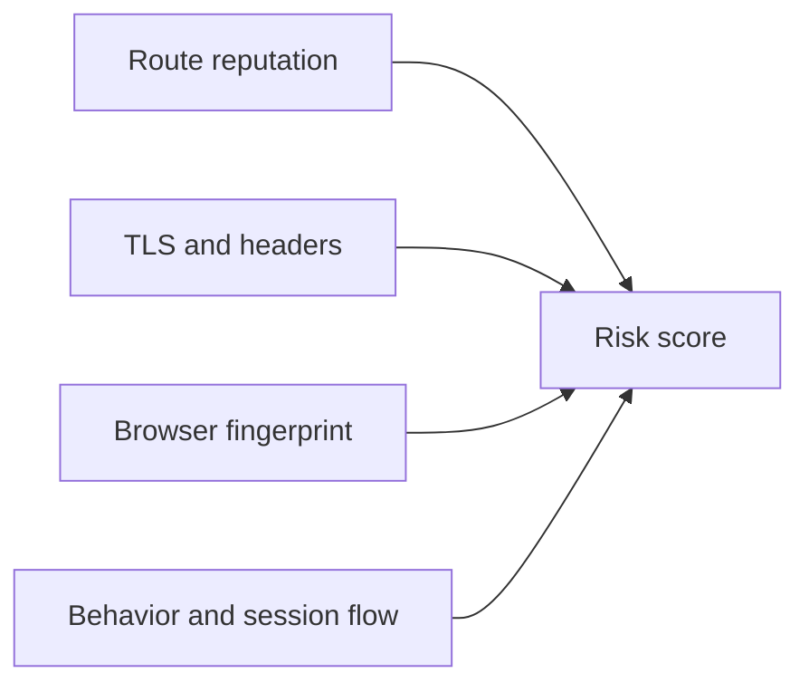

## Detection Works Because Sites Score Signals, Not Just One Clue
Most anti-bot systems do not block scrapers based on a single indicator. They combine many signals and assign risk across the full request and browser session.
That is why fixing only one layer often does not solve the problem. A residential IP with a bad browser fingerprint may still get challenged, while a realistic browser on a weak route may still get blocked.
This guide pairs well with [How Websites Detect Web Scrapers (2026)](https://bytesflows.com/blog/how-websites-detect-scrapers), [Browser Fingerprinting Explained: The Hidden Tracker](https://bytesflows.com/blog/browser-fingerprinting-explained), and [Avoid IP Bans in Automation](https://bytesflows.com/blog/avoid-ip-bans-automation).
## The Main Detection Layers
Modern detection commonly evaluates:
- IP and ASN reputation
- TLS fingerprint patterns
- HTTP header consistency
- browser fingerprint signals
- timing and navigation behavior
The important point is that these layers reinforce one another.
## IP and ASN Reputation
The first layer often evaluates where traffic comes from. Datacenter ranges are easier to flag because their ownership and usage patterns are well-known.
Residential and mobile routes often look more trustworthy because they resemble ordinary user traffic. But route quality alone is not enough if other layers still look synthetic.
## TLS Fingerprints Matter Earlier Than Many Teams Realize
TLS fingerprinting can reveal what type of client is making the connection before the page is even rendered. Non-browser clients often produce handshake patterns that differ from normal Chromium or Safari traffic.
This is one reason why strict targets often require real browser automation rather than hand-crafted HTTP requests alone.
## Header Analysis Still Works
Headers are easy to inspect and still useful for detection. Systems often look for:
- obviously scripted user agents
- missing browser-like headers
- inconsistent locale or accept values
- contradictions between user-agent claims and other request traits
A believable request needs internal consistency, not just a random user agent string.
## Browser Fingerprinting Adds Another Layer
Once JavaScript runs, the site can inspect browser properties such as:
- rendering behavior
- viewport and screen traits
- language and timezone
- automation indicators
- hardware and graphics signals
This is why browser realism matters so much on defended targets.
## Behavioral Detection Scores the Session
Even if the request looks acceptable technically, the session may still be flagged based on behavior. Common signals include:
- request bursts
- rigid interaction timing
- unnatural navigation flow
- unrealistic scrolling patterns
- repeated sessions that behave too similarly
In many real systems, behavior is the layer that turns mild suspicion into a full challenge.
## A Practical Detection Model

This is why anti-bot defense feels adaptive. The system is evaluating the whole picture, not one isolated request.
## What This Means for Scrapers
A strong defense strategy usually improves several layers together:
- healthier routes
- browser automation where required
- consistent headers and locale
- realistic session behavior
- lower pressure and better pacing
This is more effective than trying to patch one leak at a time without understanding the broader risk model.
## Common Mistakes
- blaming blocks on IPs alone when browser signals are also weak
- randomizing headers in ways that create contradictions
- ignoring TLS differences on strict targets
- treating browser automation as enough without session realism
- scaling traffic before measuring which layer is actually failing
## Conclusion
Web scraping detection methods in 2026 work by combining route, protocol, browser, and behavioral signals into a broader anti-bot score. The strongest scraping workflows respond the same way: by improving the whole request stack instead of patching only one visible symptom.
Once detection is understood as a multi-layer system, it becomes much easier to debug why a target is blocking you and where to improve next.
## Further reading
- [How Websites Detect Web Scrapers (2026)](https://bytesflows.com/blog/how-websites-detect-scrapers)
- [Browser Fingerprinting Explained: The Hidden Tracker](https://bytesflows.com/blog/browser-fingerprinting-explained)
- [Avoid IP Bans in Automation](https://bytesflows.com/blog/avoid-ip-bans-automation)
- [HTTP Header Checker - Request Headers & TLS Fingerprint](https://bytesflows.com/blog/http-header-checker)
- [Best Proxies for Web Scraping](https://bytesflows.com/blog/best-proxies-for-web-scraping)
