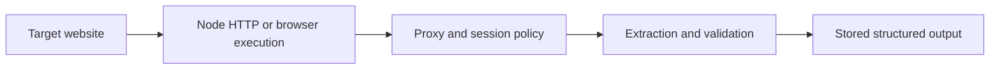

## Web Scraping with Node.js Is Less About Language Hype and More About Workflow Fit
Node.js is a strong scraping environment when the workload benefits from asynchronous I/O, browser automation tooling, or JavaScript-native data handling. But “use Node.js” is not a scraping strategy by itself. The real question is what kind of targets you need to scrape, whether the workflow is request-based or browser-based, and how you will manage proxies, concurrency, and extraction logic over time.
That is why web scraping with Node.js should be understood as a systems choice, not just a programming-language preference.
This guide explains where Node.js fits well in scraping, how request-based and browser-based approaches differ, why proxies still matter, and how to think about concurrency and reliability when building scraping workflows in JavaScript. It pairs naturally with [playwright vs Puppeteer for web scraping in 2026](https://bytesflows.com/en/blog/playwright-vs-puppeteer), [web scraping architecture explained](https://bytesflows.com/en/blog/web-scraping-architecture-explained), and [best web scraping tools in 2026](https://bytesflows.com/en/blog/best-web-scraping-tools).
## Why Node.js Is Attractive for Scraping
Node.js is useful in scraping because it often offers:
- strong asynchronous request handling
- natural integration with browser automation tools
- good fit for event-driven workflows
- easy JSON and API-heavy processing
This makes it especially appealing for teams already building in JavaScript or TypeScript.
## The First Decision: HTTP Client or Browser Automation
A Node.js scraper usually starts by choosing between two broad execution models.
### HTTP-based scraping
Useful when:
- pages are static enough
- browser execution is unnecessary
- throughput and low overhead matter most
### Browser-based scraping
Useful when:
- the page is dynamic
- JavaScript rendering matters
- anti-bot systems care about browser realism
- the workflow requires interaction or session state
This is the same core split as in Python. The difference is simply the surrounding ecosystem.
## Node.js Is Strong for Browser-Centric Workflows
One reason Node.js remains popular in scraping is its close fit with tools such as Playwright and Puppeteer.
That matters because modern scraping often requires:
- browser execution
- session handling
- async control over repeated tasks
- orchestration of high-volume crawling pipelines
For JavaScript-heavy teams, this can make Node.js feel like the most natural environment for browser-based scraping.
## Concurrency Is a Strength, but It Still Needs Discipline
Node.js can handle large volumes of async work efficiently. That is useful for scraping, but it does not remove the need for control.
You still need to manage:
- per-domain concurrency
- retries and backoff
- queueing or task batching
- memory and browser cost when browser automation is involved
Fast async execution is helpful only when the target and infrastructure can absorb it safely.
## Proxies Still Shape Real Outcomes
The language does not change the identity problem.
A Node.js scraper still needs to think about:
- route quality
- rotation or stickiness
- how repeated traffic is distributed
- when residential routing is necessary
- how retry logic changes identity after failures
This is why proxy design remains part of the scraping architecture no matter which language you use.
## Extraction Logic Should Match the Page Type
In practice, Node.js scraping often involves:
- parsing response HTML on simple pages
- extracting from rendered DOM on browser-based pages
- collecting JSON from API responses when available
The strongest Node.js systems choose the cheapest reliable extraction path rather than assuming every target needs the same toolchain.
## A Practical Node.js Scraping Model
A useful mental model looks like this:

This shows why the language is only one layer of the workflow.
## Common Mistakes
### Treating Node.js as the strategy instead of choosing the right execution model
Language alone does not solve scraping problems.
### Using browser automation everywhere by default
That can add unnecessary cost.
### Scaling async tasks without target-aware concurrency control
Fast blocking is still blocking.
### Ignoring proxy design because the tooling is modern
Route quality still dominates outcomes.
### Building extraction logic without checking whether the page is static, dynamic, or API-driven
The cheapest reliable path often differs by target.
## Best Practices for Web Scraping with Node.js
### Choose the execution model from the target, not from language loyalty
Use HTTP where HTTP is enough and browsers where browsers are required.
### Take advantage of Node’s async strengths without abandoning concurrency discipline
Throughput still needs control.
### Pair browser-based Node workflows with deliberate proxy and session strategy
Modern tooling does not replace identity design.
### Validate extracted output just as carefully as in any other language stack
Parsing success is not data quality.
### Keep the architecture focused on the workflow, not just the framework names
The real system matters more than the package list.
Helpful support tools include [HTTP Header Checker](https://bytesflows.com/en/blog/http-header-checker), [Proxy Checker](https://bytesflows.com/en/blog/proxy-checker), and [Scraping Test](https://bytesflows.com/en/blog/scraping-test-tool-detect-blocks).
## Conclusion
Web scraping with Node.js is powerful when the project benefits from asynchronous execution, browser automation integration, and JavaScript-native tooling. But the language is only one part of the decision. The real work still comes from choosing the right execution model, shaping concurrency carefully, and designing the proxy and session layer around the target.
The practical lesson is that Node.js becomes most valuable when it fits the team and the workload, not because it magically simplifies scraping. When paired with the right browser or HTTP approach, sound routing, and clean extraction logic, it is one of the strongest environments for building modern scraping systems.
If you want the strongest next reading path from here, continue with [playwright vs Puppeteer for web scraping in 2026](https://bytesflows.com/en/blog/playwright-vs-puppeteer), [web scraping architecture explained](https://bytesflows.com/en/blog/web-scraping-architecture-explained), [best web scraping tools in 2026](https://bytesflows.com/en/blog/best-web-scraping-tools), and [how to scrape websites without getting blocked](https://bytesflows.com/en/blog/scrape-websites-without-getting-blocked).
## Further reading
- [Playwright vs Puppeteer for web scraping in 2026](https://bytesflows.com/en/blog/playwright-vs-puppeteer)
- [Web scraping architecture explained](https://bytesflows.com/en/blog/web-scraping-architecture-explained)
- [Best web scraping tools in 2026](https://bytesflows.com/en/blog/best-web-scraping-tools)
- [How to scrape websites without getting blocked](https://bytesflows.com/en/blog/scrape-websites-without-getting-blocked)
- [Best proxies for web scraping](https://bytesflows.com/en/blog/best-proxies-for-web-scraping)
- [Playwright proxy setup guide](https://bytesflows.com/en/blog/playwright-proxy-setup)
- [The ultimate guide to web scraping in 2026](https://bytesflows.com/en/blog/ultimate-guide-web-scraping-2026)
