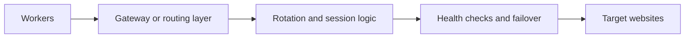

## Proxy Architecture Becomes the Bottleneck Once Scraping Starts Repeating at Scale
A scraper can have clean parsing logic, a good queue, and fast workers—and still fail once traffic grows. That is because the fetch layer is only part of the system. The identity layer matters just as much.
When requests start repeating across many URLs, domains, or sessions, the proxy design often becomes the real bottleneck. Weak proxy architecture creates blocks, inconsistent results, poor failover, and unstable scale even if the scraper code itself is solid.
This guide explains the core design patterns behind web scraping proxy architecture, including gateway models, rotation strategies, failover, health checks, and the operational tradeoffs between simplicity and control. It pairs naturally with [proxy pools for web scraping](https://bytesflows.com/blog/proxy-pools-web-scraping), [web scraping architecture explained](https://bytesflows.com/blog/web-scraping-architecture-explained), and [scraping data at scale](https://bytesflows.com/blog/scraping-data-at-scale).
## What Proxy Architecture Actually Means
Proxy architecture is the design of how scraper traffic is routed, distributed, monitored, and recovered when things go wrong.
That usually includes:
- where requests enter the proxy layer
- how IPs are rotated or assigned
- how failures trigger retries or rerouting
- how health is checked
- how different domains or workloads are isolated
This is important because “using a proxy” is only the start. Architecture is about how proxy behavior interacts with real scraping workloads over time.
## The Simplest Model: A Single Rotating Gateway
For many teams, the simplest useful design is one rotating residential gateway.
That means:
- workers send traffic to one endpoint
- the provider handles exit-IP rotation
- session behavior is controlled by provider rules or configuration
- the scraper avoids managing individual proxy IPs directly
This works well because it reduces operational complexity and gives many teams enough reliability without forcing them to build their own proxy-control plane.
## When Simplicity Starts to Break
A single gateway may become limiting when:
- different domains need different traffic behavior
- one workload is much noisier than another
- geo requirements vary significantly
- one provider is not enough for resilience
- failover and health visibility become more important
That is the point where proxy architecture becomes a design problem rather than just a configuration choice.
## Core Components of Proxy Architecture
### Gateway or endpoint layer
This is the point where scraper traffic enters the proxy system.
### Rotation logic
This determines whether IPs change per request, per session, per worker, or after specific failures.
### Health checks
These confirm whether the proxy path is reachable and behaving as expected.
### Failover logic
This handles what happens when the current path becomes unreliable.
### Routing policy
This determines which workload uses which proxy behavior.
Together, these layers shape whether the proxy system feels stable or random under real traffic.
## Common Architecture Patterns
### Single rotating gateway
Best for:
- simpler deployments
- moderate scale
- teams that want minimal operational overhead
### Per-worker or per-session routing
Best for:
- workloads that need more isolation
- sticky session design
- long-running job segmentation
### Queue plus proxy-per-task routing
Best for:
- heterogeneous targets
- more precise per-domain controls
- advanced scaling logic
### Multi-provider failover
Best for:
- stricter production systems
- resilience requirements
- reducing dependency on one provider path
Each pattern trades simplicity for control.
## Why Rotation Strategy Is Architectural, Not Cosmetic
Rotation is not just a convenience setting. It determines how traffic identity is distributed across the workload.
A useful rotation design should consider:
- whether tasks are stateless or session-sensitive
- how much load each domain can tolerate
- whether retries should switch identity
- whether geo should remain stable
- how repeated traffic is spread over time
This is why articles like [proxy rotation strategies](https://bytesflows.com/blog/proxy-rotation-strategies), [rotating proxies for web scraping](https://bytesflows.com/blog/rotating-proxies-web-scraping), and [how many proxies do you need](https://bytesflows.com/blog/how-many-proxies-need-scraping) fit directly into proxy architecture design.
## Why Health Checks Matter
A proxy layer can fail in ways that are easy to misdiagnose.
For example:
- credentials may be valid but routing may be slow
- the exit region may be wrong
- only some IPs in the pool may be burned
- success rate may vary by target rather than by raw connectivity
That is why health checks should not only ask “Does the proxy respond?” They should also ask whether it responds well enough for the actual workload.
## Failover Is About Continuity, Not Panic
Failover logic becomes important when proxy quality is inconsistent or when the workload is large enough that one failure path can hurt a whole batch.
Good failover usually means:
- retrying intelligently, not endlessly
- switching paths when repeated failures cluster
- avoiding immediate reuse of obviously bad routes
- keeping visibility into whether the provider or the target caused the problem
Without that, the scraper often amplifies proxy instability instead of containing it.
## A Practical Proxy Architecture Diagram
A useful model looks like this:

This illustrates the key point: proxy architecture is a system, not just a credential string.
## Common Mistakes
### Assuming one proxy endpoint solves every workload
Different domains and job types often need different behavior.
### Rotating without considering session needs
Too much rotation can be as harmful as too little.
### Treating failover as simple retry
Retrying the same bad path repeatedly is not resilience.
### Ignoring health visibility
A proxy that “works sometimes” may still be architecture debt.
### Scaling requests before validating routing quality
More volume exposes proxy weakness much faster.
## Best Practices for Proxy Architecture
### Start simple, then segment only when needed
Do not overbuild before the workload demands it.
### Match rotation strategy to task type
Public broad scraping and session-dependent flows want different identity behavior.
### Build health checks around target success, not only raw connectivity
The real workload should define proxy quality.
### Add failover deliberately
Resilience should reduce noise, not increase it.
### Keep routing decisions observable
Proxy architecture becomes hard to improve when it is opaque.
Helpful support tools include [Proxy Checker](https://bytesflows.com/blog/proxy-checker), [Proxy Rotator Playground](https://bytesflows.com/blog/proxy-rotator), and [Scraping Test](https://bytesflows.com/blog/scraping-test-tool-detect-blocks).
## Conclusion
Web scraping proxy architecture is the design of how scraping traffic keeps working once the workload becomes repeated, large, and sensitive to identity. The right architecture balances simplicity, rotation quality, failover, health visibility, and workload segmentation.
For many teams, one rotating residential gateway is enough at first. As the system grows, proxy architecture becomes more about control: which jobs should share identity, which ones should not, how failures are detected, and how routing remains stable under pressure. That is what makes proxy architecture a core scraping concern rather than a secondary detail.
If you want the strongest next reading path from here, continue with [proxy pools for web scraping](https://bytesflows.com/blog/proxy-pools-web-scraping), [scraping data at scale](https://bytesflows.com/blog/scraping-data-at-scale), [best proxies for web scraping](https://bytesflows.com/blog/best-proxies-for-web-scraping), and [web scraping architecture explained](https://bytesflows.com/blog/web-scraping-architecture-explained).
## Further reading
- [Proxy pools for web scraping](https://bytesflows.com/blog/proxy-pools-web-scraping)
- [Scraping data at scale](https://bytesflows.com/blog/scraping-data-at-scale)
- [Best proxies for web scraping](https://bytesflows.com/blog/best-proxies-for-web-scraping)
- [Web scraping architecture explained](https://bytesflows.com/blog/web-scraping-architecture-explained)
- [Residential proxies](https://bytesflows.com/blog/residential-proxies)
- [Proxy rotation strategies](https://bytesflows.com/blog/proxy-rotation-strategies)
- [How many proxies do you need](https://bytesflows.com/blog/how-many-proxies-need-scraping)
