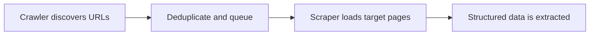

## Why People Confuse Scraping and Crawling
Web scraping and web crawling are closely related, so they are often treated as the same thing. But they solve different problems. Crawling is mainly about discovering pages. Scraping is mainly about extracting structured data from those pages.
That distinction matters because it affects tool choice, system design, and performance expectations. This guide pairs well with [Web Scraping Workflow Explained](https://bytesflows.com/blog/web-scraping-workflow-explained), [How Web Scraping Works Behind the Scenes (2026)](https://bytesflows.com/blog/how-web-scraping-works), and [Web Scraping Architecture Explained](https://bytesflows.com/blog/web-scraping-architecture-explained).
## What Web Crawling Means
Crawling is the process of discovering URLs and deciding which ones should be visited next. A crawler may:
- follow links
- process sitemaps
- discover new pages from search or category listings
- normalize and deduplicate URLs
- build a target queue for later processing
The output of crawling is usually coverage, not finished structured data.
## What Web Scraping Means
Scraping is the process of loading a page and extracting the fields you care about, such as:
- product titles and prices
- job listings and salaries
- search results and rankings
- article headlines and timestamps
- profile or review data
The output of scraping is structured information, not just a URL list.
## The Simplest Difference
| Question | Crawling | Scraping |
| --- | --- | --- |
| Main goal | Find pages | Extract data |
| Main output | URL set or page inventory | Structured records |
| Typical challenge | Coverage and link handling | Field accuracy and normalization |
## When You Need Crawling
Crawling is the right starting point when:
- you do not already have the target URLs
- pages are discovered through category structure or pagination
- you want broad site coverage
- the system must keep finding newly published pages over time
In these cases, discovery is the bottleneck.
## When You Need Scraping
Scraping is the right focus when:
- you already know which URLs matter
- the main goal is structured fields, not page discovery
- extraction accuracy matters more than URL coverage
- downstream systems need normalized records
In these cases, data quality is the bottleneck.
## Most Real Systems Use Both
A common production pattern looks like this:
1. crawl listing or category pages
1. collect and deduplicate target URLs
1. enqueue detail pages
1. scrape structured fields from each target page

This is why the two concepts are different but often work together.
## Tooling Differences
Crawlers often emphasize:
- URL discovery
- deduplication
- queueing
- politeness and traversal rules
Scrapers often emphasize:
- selectors or extraction logic
- browser rendering when needed
- schema validation
- normalization and storage
The overlap is real, but the design priorities are different.
## Common Mistakes
- using scraping logic when the real missing piece is URL discovery
- building a crawler when the target URL list is already fixed
- treating raw crawled pages as if they were structured data
- failing to deduplicate URLs before scraping
- mixing crawler and scraper responsibilities into one brittle process
## Conclusion
Web crawling and web scraping are not interchangeable. Crawling is about finding the pages that matter. Scraping is about extracting the information from those pages. Once that difference is clear, it becomes much easier to design the right workflow and choose the right tools.
Most strong data pipelines use both, but they do so with clearly separated responsibilities.
## Further reading
- [Web Scraping Workflow Explained](https://bytesflows.com/blog/web-scraping-workflow-explained)
- [How Web Scraping Works Behind the Scenes (2026)](https://bytesflows.com/blog/how-web-scraping-works)
- [Web Scraping Architecture Explained](https://bytesflows.com/blog/web-scraping-architecture-explained)
- [Scraping Data at Scale](https://bytesflows.com/blog/scraping-data-at-scale)
- [How to Build Your First Web Scraper](https://bytesflows.com/blog/how-to-build-first-web-scraper)
