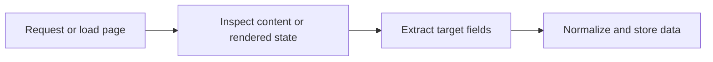

## What Web Scraping Actually Means
Web scraping is the process of collecting data from websites in a structured way. Instead of copying information by hand, a scraper requests or loads a page, identifies the useful fields, and stores them as structured records such as JSON, CSV, or database rows.
At a high level, scraping is about turning web pages into reusable data.
This guide pairs naturally with [Web Scraping Workflow Explained](https://bytesflows.com/blog/web-scraping-workflow-explained), [How to Build Your First Web Scraper](https://bytesflows.com/blog/how-to-build-first-web-scraper), and [Web Scraping vs Web Crawling - What's the Difference (2026)](https://bytesflows.com/blog/web-scraping-vs-web-crawling).
## Why People Use Web Scraping
Teams scrape websites for many different reasons:
- price and competitor monitoring
- job and market intelligence
- news and content research
- SEO and search analysis
- lead generation and enrichment
- dataset creation for analytics and AI systems
The common thread is simple: the website already displays the information, and the goal is to collect it systematically.
## How Web Scraping Works
A basic scraping workflow usually looks like this:
1. request or load a page
1. inspect the returned content or rendered browser state
1. identify the fields you want
1. extract and normalize the values
1. store the results for later use

The exact tools vary, but the core process stays similar.
## Web Scraping Versus Web Crawling
These terms are related but not identical.
### Web crawling
Crawling is mainly about discovering URLs by following links or processing site structure.
### Web scraping
Scraping is mainly about extracting structured data from specific pages.
Many real systems do both: crawl first, scrape second.
## Static Pages Versus Dynamic Pages
Some pages expose useful data directly in the HTML. Others load key content later through JavaScript.
That distinction matters because it changes the tool choice.
### Static pages
Often workable with lightweight HTTP requests and HTML parsing.
### Dynamic pages
Often need browser automation such as Playwright because the useful data appears only after rendering, scrolling, or interaction.
## Why Proxies Sometimes Matter
A beginner can learn scraping without proxies. But proxies become important when:
- you scrape many pages from the same site
- the target blocks repeated requests
- the site changes content by region
- the target is commercially defended
Residential proxies are often more effective than datacenter IPs on stricter sites because they look more like ordinary user traffic.
## Common Beginner Tools
| Need | Typical tool choice |
| --- | --- |
| Static page extraction | Requests plus Beautiful Soup |
| Dynamic page extraction | Playwright |
| Larger crawling workflows | Scrapy or Crawlee |
| One-off manual extraction | Browser extension or no-code tool |
## Legal and Ethical Considerations
Web scraping is not only a technical activity. It also requires judgment.
You should think about:
- whether the data is public
- the target site's terms and access rules
- robots.txt guidance
- privacy and personal data issues
- whether your request volume is responsible
The exact legal answer depends on jurisdiction and use case, so real commercial projects should get proper legal review.
## Common Mistakes
- assuming every page is static
- scraping too quickly from one IP
- skipping validation of extracted data
- ignoring ToS, robots.txt, and privacy issues
- trying to scale before understanding the page structure
## Conclusion
Web scraping is the practice of turning website content into structured data. Once that basic idea is clear, the rest of the learning path becomes much easier: understand the page type, choose the lightest tool that works, add browser automation only when needed, and add proxies when scale or protection makes them necessary.
That is the foundation behind almost every professional scraping workflow.
## Further reading
- [Web Scraping Workflow Explained](https://bytesflows.com/blog/web-scraping-workflow-explained)
- [How to Build Your First Web Scraper](https://bytesflows.com/blog/how-to-build-first-web-scraper)
- [Web Scraping vs Web Crawling - What's the Difference (2026)](https://bytesflows.com/blog/web-scraping-vs-web-crawling)
- [Best Web Scraping Tools in 2026 - Comparison & Guide](https://bytesflows.com/blog/best-web-scraping-tools)
- [How to Scrape Websites Without Getting Blocked: The 2026 Stealth Playbook](https://bytesflows.com/blog/scrape-websites-without-getting-blocked)
