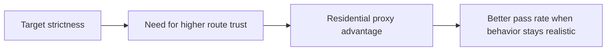

## Residential Proxies Are Often Best for Scraping Because Modern Targets Judge Trust Before They Judge Your Parser
A scraper can fail even when the code is correct, the selectors are stable, and the browser is configured properly. On many modern sites, the first serious bottleneck is not extraction logic at all. It is whether the traffic identity looks trustworthy enough to receive the page without blocks, challenges, or degraded content. That is where residential proxies become so important.
Residential proxies are often the best choice for scraping because they make the traffic look closer to ordinary consumer behavior than typical datacenter routes can.
This guide explains why residential proxies tend to outperform other route types on stricter targets, where the advantage is most visible, what tradeoffs come with the higher cost, and when paying for residential trust is actually worth it. It pairs naturally with [datacenter vs residential proxies](https://bytesflows.com/blog/datacenter-vs-residential-proxies), [best proxies for web scraping](https://bytesflows.com/blog/best-proxies-for-web-scraping), and [residential proxies](https://bytesflows.com/proxies).
## Why Residential Proxies Start from a Stronger Trust Position
Residential proxies use IP addresses assigned through consumer internet networks rather than obvious hosting or cloud ranges.
That matters because many anti-bot systems score traffic partly by:
- IP reputation
- ASN type
- whether the route looks like consumer traffic or infrastructure traffic
- how costly it would be to block that route broadly
Residential traffic often begins with a more credible starting assumption than datacenter traffic does.
## Why Datacenter Routes Often Struggle on Protected Targets
Datacenter proxies are often faster and cheaper, but they are also easier for many sites to distrust.
That is especially true when targets already monitor:
- known hosting ranges
- cloud ASNs
- repeated traffic from automation-heavy networks
- suspicious scaling behavior across clearly non-consumer routes
This is why datacenter routes can feel efficient on easier sites and deeply unreliable on stricter ones.
## Residential Proxies Improve More Than Just Block Rate
The value of residential routes is not only “fewer 403s.” They can also improve:
- pass rate on challenge-heavy sites
- geo consistency for region-sensitive pages
- browser session credibility on stricter flows
- long-run stability under repeated crawling
That broader reliability is why residential proxies are so often recommended for serious scraping work.
## Where Residential Proxies Usually Matter Most
Residential routes are especially useful when scraping:
- ecommerce and marketplace targets
- search and SERP environments
- geo-sensitive pages
- social or account-sensitive platforms
- Cloudflare or anti-bot-heavy browser workflows
On these targets, route trust is often one of the main factors separating workable scraping from repeated failure.
## Why Residential Works So Well with Browser Automation
On stricter sites, a real browser alone is often not enough.
Browser automation helps with:
- JavaScript execution
- browser-side session behavior
- rendering and interaction
Residential routing helps with:
- traffic trust
- better IP reputation
- more believable origin identity
This is why residential proxies plus browser automation are such a common baseline for protected scraping.
## The Tradeoff: Better Trust Usually Costs More
Residential proxies are often more expensive than datacenter routes, and that cost matters.
The right question is not “are residential proxies cheap?” It is:
- how much engineering time and retry waste do weak routes create?
- how much value is lost when the scraper cannot access the target reliably?
- how expensive is low pass rate compared with better route trust?
In many protected workflows, higher proxy cost is justified because failure cost is even higher.
## Residential Does Not Remove the Need for Good Behavior
A residential IP is not a license to scrape recklessly.
Bad behavior can still create problems through:
- high concurrency
- unrealistic browser or request timing
- poor retry design
- session patterns that still look synthetic
Residential proxies help most when the rest of the scraper also behaves sensibly.
## A Practical Comparison Model
A useful mental model looks like this:

This shows why residential proxies often win where trust is the limiting factor.
## Common Mistakes
### Comparing residential and datacenter only on price
Low price can be expensive when failure is frequent.
### Assuming residential routing alone solves poor scraper behavior
The session still has to look sane.
### Using datacenter proxies on targets that already distrust cloud traffic heavily
This creates avoidable failure.
### Buying residential routes without checking geo, ASN, or provider quality
Not all residential products behave equally well.
### Treating residential as unnecessary because a small test worked on one local machine
Real volume often reveals the routing bottleneck later.
## Best Practices
### Use residential proxies when IP trust is one of the main access problems
That is where they usually create the most value.
### Pair residential routing with browser automation on stricter dynamic targets
The two layers reinforce each other.
### Validate route quality before large-scale rollout
Country, ASN, and behavior still matter.
### Compare residential cost against real block, retry, and maintenance cost
Not only against raw bandwidth price.
### Keep concurrency and retry logic disciplined even on strong routes
Good trust still needs good session behavior.
Helpful companion tools include [Proxy Checker](https://bytesflows.com/blog/proxy-checker), [Proxy Rotator Playground](https://bytesflows.com/blog/proxy-rotator), and [Scraping Test](https://bytesflows.com/blog/scraping-test).
## Conclusion
Residential proxies are often best for scraping because many modern sites judge traffic trust before they ever expose the content your scraper wants. By starting from a more credible consumer-like network identity, residential routes often unlock better pass rate, stronger geo realism, and more stable long-run access than cheaper datacenter alternatives.
The practical lesson is that residential proxies are worth the premium when trust is the bottleneck. On easier sites, that premium may be unnecessary. On stricter targets, it is often the difference between a scraper that keeps working and one that spends its time fighting blocks instead of collecting data.
If you want the strongest next reading path from here, continue with [datacenter vs residential proxies](https://bytesflows.com/blog/datacenter-vs-residential-proxies), [best proxies for web scraping](https://bytesflows.com/blog/best-proxies-for-web-scraping), [residential proxies](https://bytesflows.com/proxies), and [proxy rotation strategies](https://bytesflows.com/blog/proxy-rotation-strategies).
## Further reading
- [Datacenter vs residential proxies](https://bytesflows.com/blog/datacenter-vs-residential-proxies)
- [Best proxies for web scraping](https://bytesflows.com/blog/best-proxies-for-web-scraping)
- [Residential proxies](https://bytesflows.com/proxies)
- [Proxy rotation strategies](https://bytesflows.com/blog/proxy-rotation-strategies)
- [How residential proxies improve scraping success](https://bytesflows.com/blog/residential-proxies-improve-scraping)
- [Cloudflare bypass proxy for web scraping](https://bytesflows.com/blog/cloudflare-scraping)
- [How to scrape websites without getting blocked](https://bytesflows.com/blog/scrape-websites-without-getting-blocked)
